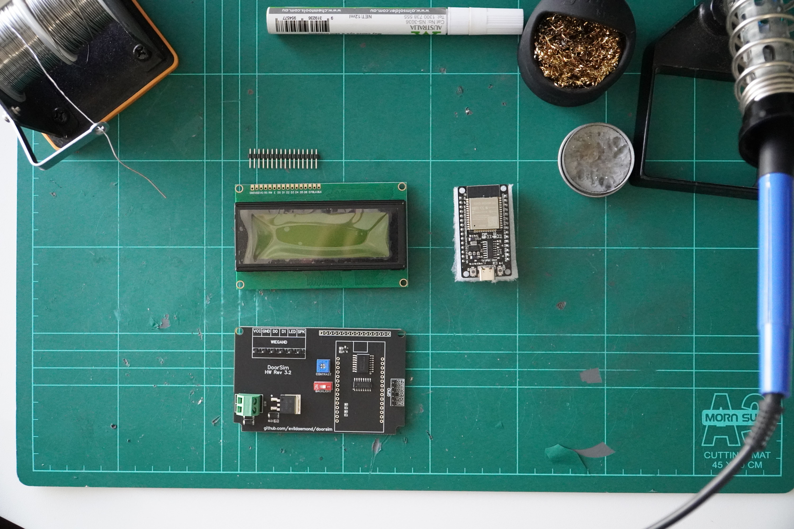
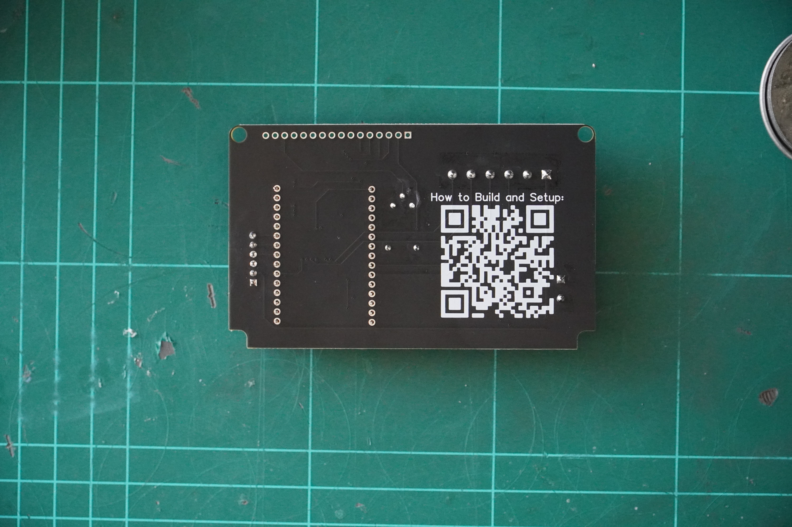
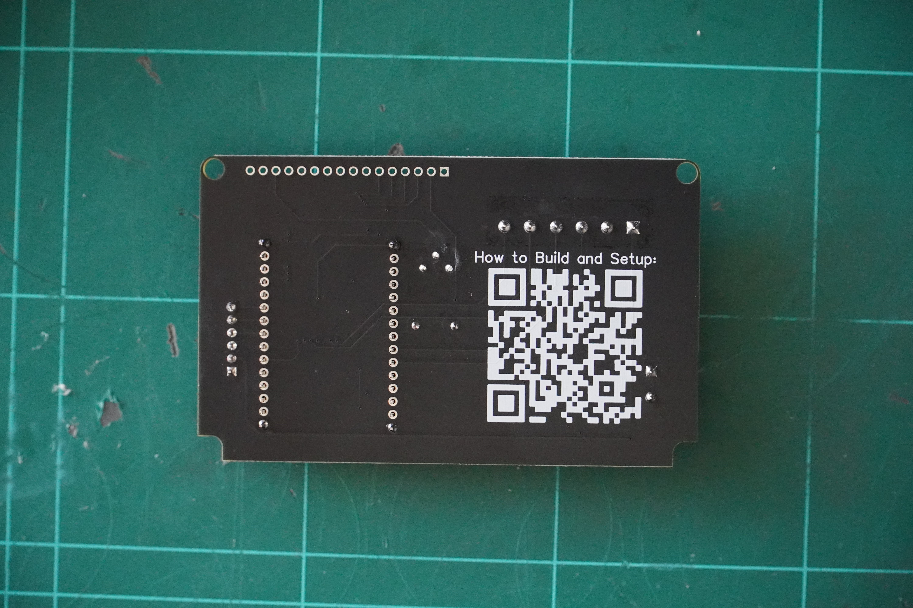
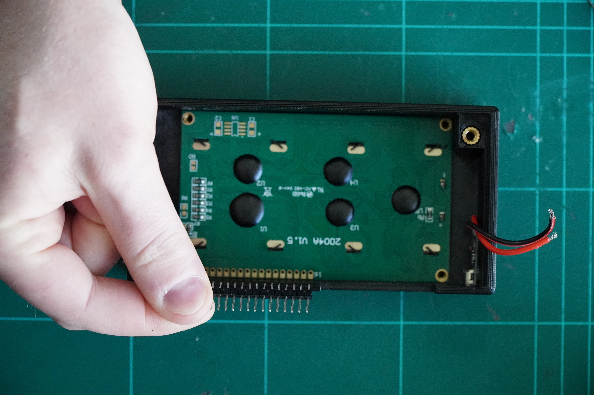
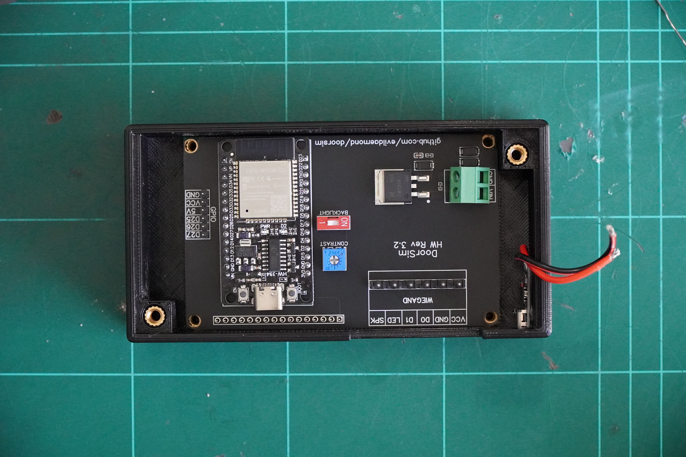
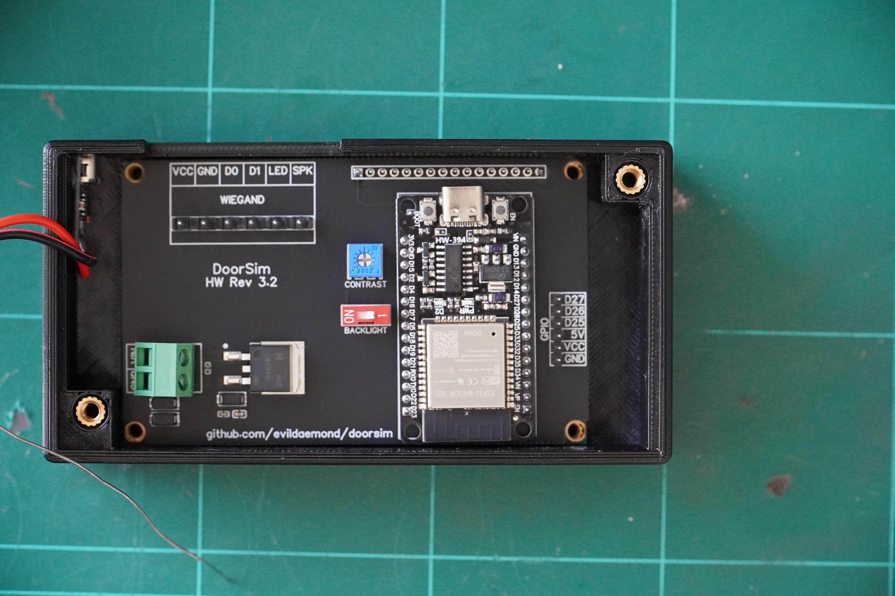
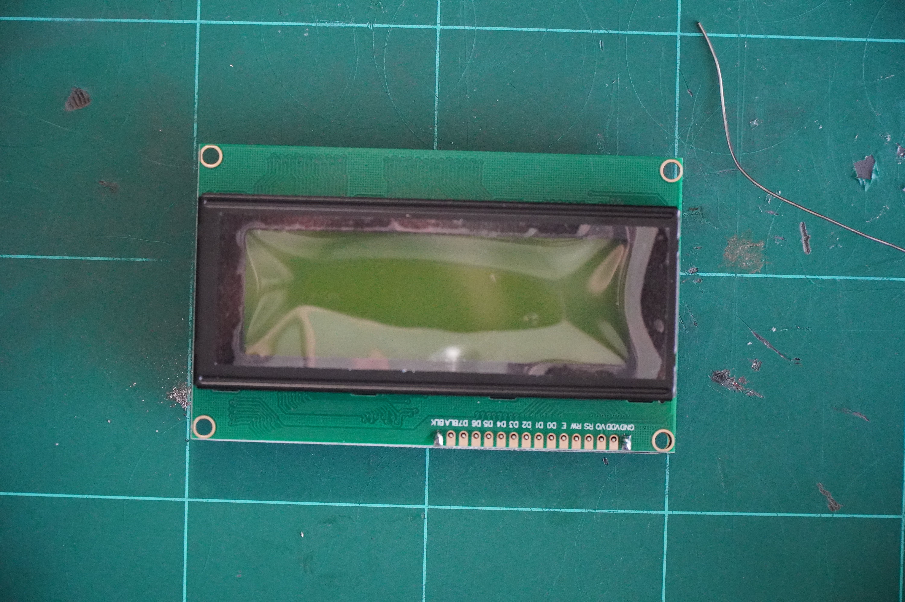
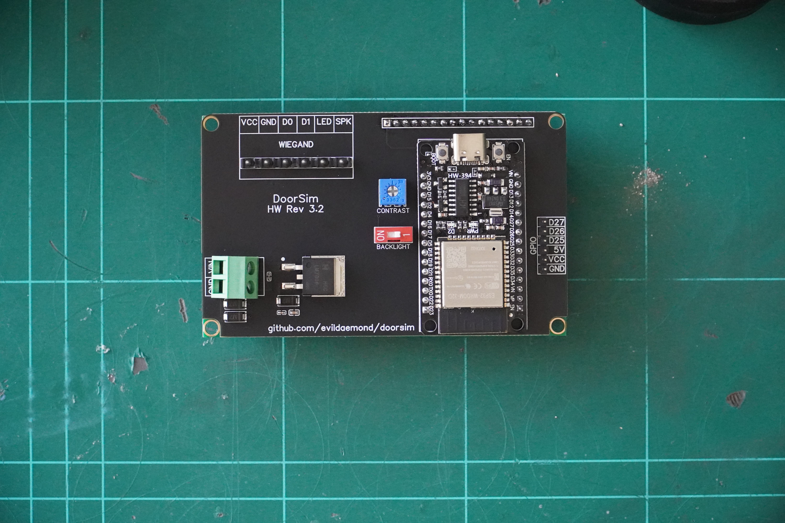
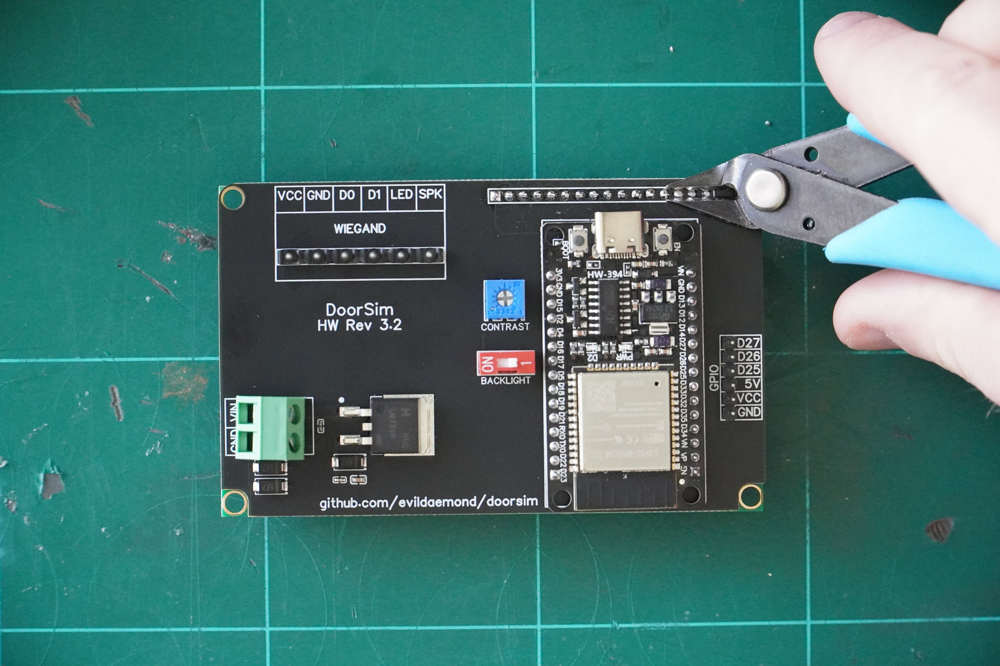
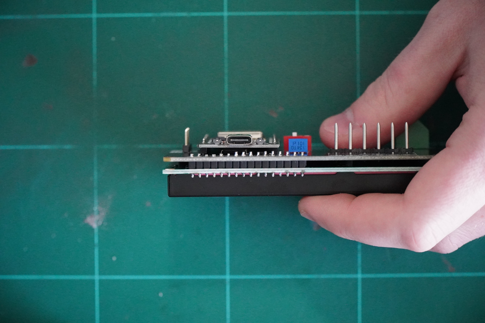

# doorsim

The DoorSim is a Open Source PACS (Physical Access Control System) built for research, training, and CTFs on RFID and Physical Security. 

## Features

- Custom PCB with ESP32 Base
- Wiegand interface with Industry Standard Connectors
- 2004a Display for Ease of Reading
- Web Interface for Card/Event Reading and Settings
- Inbuilt CTF Mode with event logs
- USB-C PD Power Supply
- Expandable GPIO
- Multiple 3d Printed Desktop Reader Cases

## Bill of Materials

### PCB

|Quantity|Name|Link|
|---|---|---|
|1|PCB||
|1|ESP32-WROOM-32D Development Board|<https://www.aliexpress.com/item/1005006476877078.html>|
|1|2004A Display (Bare without i2c converter)|<https://www.aliexpress.com/item/1005005973980073.html?spm=a2g0o.order_list.order_list_main.22.3d051802PKVqRJ>|
|1|USB-C PD Trigger Board|<https://www.aliexpress.com/item/1005004381460387.html>|
|3|5.0-2P Screw Terminal Blocks|<https://www.lcsc.com/product-detail/Screw-terminal_Cixi-Kefa-Elec-KF332K-5-0-2P_C474889.html>|
|1|2.54mm 1x16 male-male header pins|<https://www.aliexpress.com/item/1005001514058091.html>|

### Cases

#### Handheld Version

|Quantity|Name|Link|
|---|---|---|
|1|Case Body||
|1|Case Bottom||
|2|M3 Standard CNC Kitchen Threaded Insert|https://cnckitchen.store/products/gewindeeinsatz-threaded-insert-m3-standard-100-stk-pcs|
|4|M4 Standard CNC Kitchen Threaded Insert|https://cnckitchen.store/products/gewindeeinsatz-threaded-insert-m4-standard-50-stk-pcs|
|4|M3x10 Round Head Screw||
|2|M4x10 Flat Head Screw||

#### All Others

|Quantity|Name|Link|
|---|---|---|
|1|Case Body||
|1|Case Bottom||
|2|M3 Standard CNC Kitchen Threaded Insert|https://cnckitchen.store/products/gewindeeinsatz-threaded-insert-m3-standard-100-stk-pcs|
|4|M4 Standard CNC Kitchen Threaded Insert|https://cnckitchen.store/products/gewindeeinsatz-threaded-insert-m4-standard-50-stk-pcs|
|2|M3 Nut||
|2|M3x12 Flat Head Screw||
|4|M3x10 Round Head Screw||
|4|M4x10 Flat Head Screw||

### RFID Reader

The design of the DoorSim at this stage means you can use any RFID Reader which supports Wiegand Output. The only difference will be the 3d printed case you house the doorsim in, only if you intend to use it as a non-handheld version. 

## Build Steps

### Soldering

Soldering guide assumes minimal soldering experience and only through hole construction

1. Collect all required items in Main Board Bill of Materials

1. Insert legs of the ESP32-WROOM-32D Development Board into PCB

1. Apply flux and solder legs in place, apply light pressure from the back on the development board and start at each corner, try to keep the board flat

1. Trim down the pins legs to roughly 2mm (078740157 Inches) and clean any leftover residue lightly with isopropyl alcohol and a old toothbrush

1. Fit the male-to-male header pins between the 2004a display and the PCB, with the longer side facing up

1. Applying pressure to the left and top sides of the PCB and 2004a display, apply flux and solder the 2 pins of the opposing sides on the PCB. 
    1. Hint: They should be alligned with the holes on the board

1. Flip over the board, applying pressure on the same sides, and do the same on the 2004a display side.

1. Solder in the rest of the pins on both the display and PCB

1. Trim the PCB Side of the pin legs to roughly 2mm (078740157 Inches) and clean any leftover residue lightly with isopropyl alcohol and a old toothbrush

1. *Optional:* In some cases, you may need to trim or elongate the wires for the USB-PD Connector, recommendation is to measure and cut, remove old wire connectors from board, and tin the ends before inserting and screwing into terminal connectors

### Case

1. Using the M3 Standard Threaded Insert, insert 4 into the 2004a Display hole, applying with a soldering iron, try to keep it straight up as you insert, applying light pressure
    1. Hint: Using a set of tweesers will help here 
1. Using the M4 Standard Threaded Insert, insert them into the case posts, applying with a soldering iron, try to keep it straight up as you insert, applying light pressure

### Programming

1. Install Arduino IDE
1. Install Requirements
    1. ESP32 Board Manager
    2. [ArdunioJson by Benoit Blanchon](https://arduinojson.org/)
    3. [AsyncTCP by dvarrel](https://github.com/dvarrel/AsyncTCP)
    4. [ESPAsyncWebServer by Me-No-Dev](https://github.com/me-no-dev/ESPAsyncWebServer)
    5. [LiquidCrystal_I2C](https://github.com/fdebrabander/Arduino-LiquidCrystal-I2C-library)
1. Git Clone and Open File
1. Choose Board, Choose Port
1. Click Upload
1. If required, when reached connecting, Hold Boot button
1. Once Complete, unplug device

### Fixtures

#### USB-PD

1. Using either hot glue or double sided tape, apply the tape to the back of the PCB for the USB-PD Adaptor, and apply it to the hole for the USB-PD Adaptor (It may require a small amount of extra force to do this)
    1. In the handheld design, this can be hard due to the space, inserting from the front instead is also an option

#### PCB

1. Mount the PCB to the case of your choice, using 4 x M3x10 Round Head Screws (Preferabily Hex keyed)
1. Attach the USB-PD Leads to your screw terminal, with the Red being screwed into VIN, and the Black and Red stripe to GND
1. Insert the cables for your RFID reader into the Screw Terminal Blocks, using the supplied wiring diagram for your RFID Reader, then insert it into your PCB

#### Case

1. Attach your RFID Readers mounting bracket using M3x12 M3x12 Flat Head Screws (Preferabily Hex keyed) and M3 Nuts (Washers can be used, but should be fine without)
1. Attach the Case Bottom to the Case using M4x10 Flat Head Screws (Preferabily Hex keyed) which can be screwed into the heat-set threaded inserts

### Testing

1. Unscrew the case bottom, exposing the PCB
1. Plug in a USB-PD Capible connector, such as a laptop charger
1. Flick the Backlight Switch from OFF to ON (may be marked as 1 instead of OFF), you should see the displays backlight turn on
1. Using a small flathead screwdriver, rotate the Contrast Potentiomiter to the right until the display reads well for you
    1. If it feels too dark, or is hard to read, ajusting this sensor will fix that
1. Using a device with Wifi access, check for the Wireless Access Point "Doorsim", by default, this should have no password
1. Connect to the Wifi Network, and verify that the network can be accessed, and browse to `http://192.168.4.1`
    1. Note: This may have issues on phones, this is how Android/iOS works with these networks, as they do not have internet.

## Use

### Web Interface

- Accessable via Wifi Network Broadcasting on ESP32
    - Can be configured via the Settings menu on the Web Interface
- Browse to `http://192.168.4.1`
- Last Swiped Card Interface, displaying card information
    - Hint: Click on the Hex Code for the Card to copy it to clipboard
- CTF Board will show the CTF interface, alongside the additional cards to be added, and the last swiped cards
    - Hint: CTF Configurations can be imported and exported using the buttons avalible
- Settings menu allows you to change basic settings of the device

### Display

- Displays generic messaging or CTF messaging based upon enabled mode
    - Can be configured via the Settings menu on the Web Interface
- Displays either the card information of the last swiped card or the invalid/valid response of a card

### Modes

#### CTF Mode

- Presents Generic Message for DoorSim on Display
- Can be customised
- Displays Incorrect for cards not found in device
- Web Interface shows all data in Last Swiped Cards 
- Web Interface CTF Board will show CN/FC of last invalid card swiped, shows users authorised with only their name

#### Demo Mode

- Presents Generic Message for DoorSim on Display
- Display the Card Number and Facility Code for each card scanned on the 2004a display
- Web Interface shows all data in Last Swiped Cards 
- Web Interface CTF Board will show HEX of cards swiped

## Screenshots

## Acknowledgements

- Core Weigand and card decoding based upon [Tusk](https://github.com/TeamWalrus/tusk) 
- Design inspiration by [RTA Door Simulator](https://shop.redteamalliance.com/products/rfid-hacking-and-defense-physical-access-control-systems-pacs-proxmark3-training)
